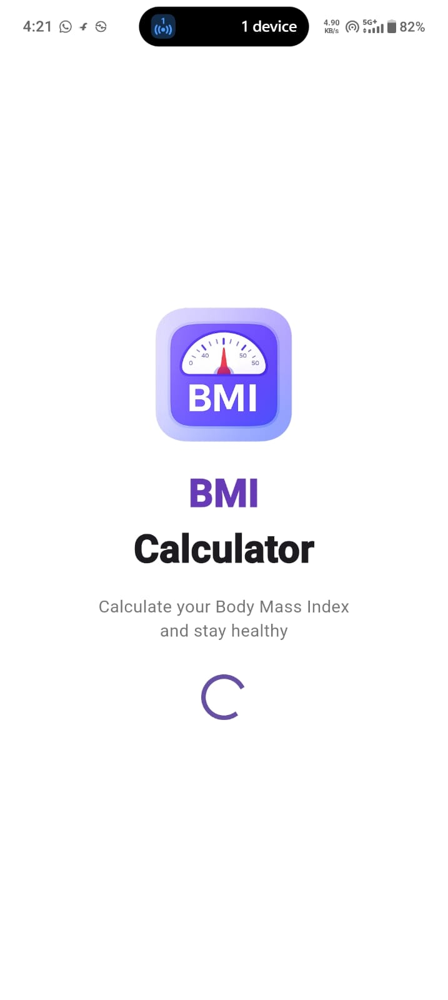
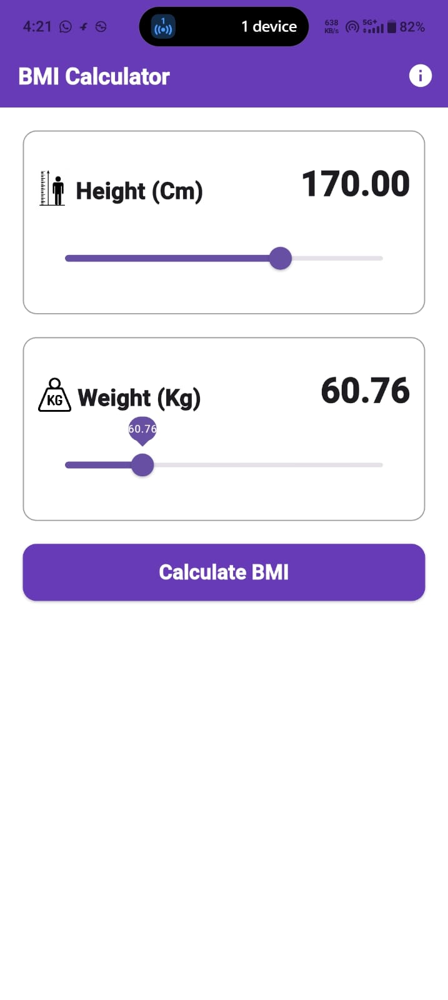
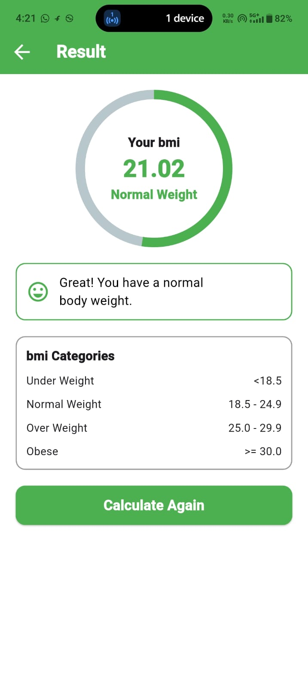
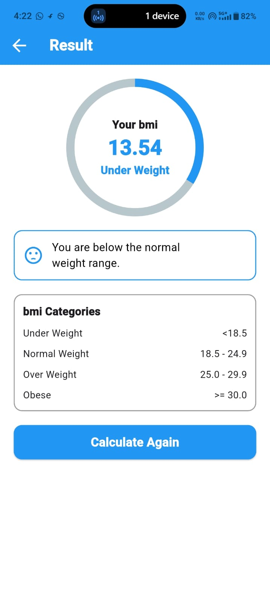
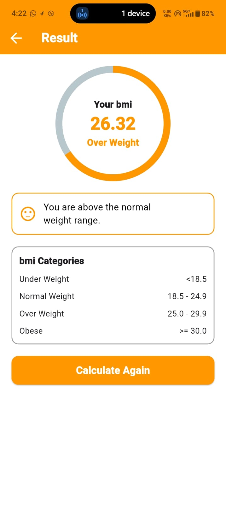
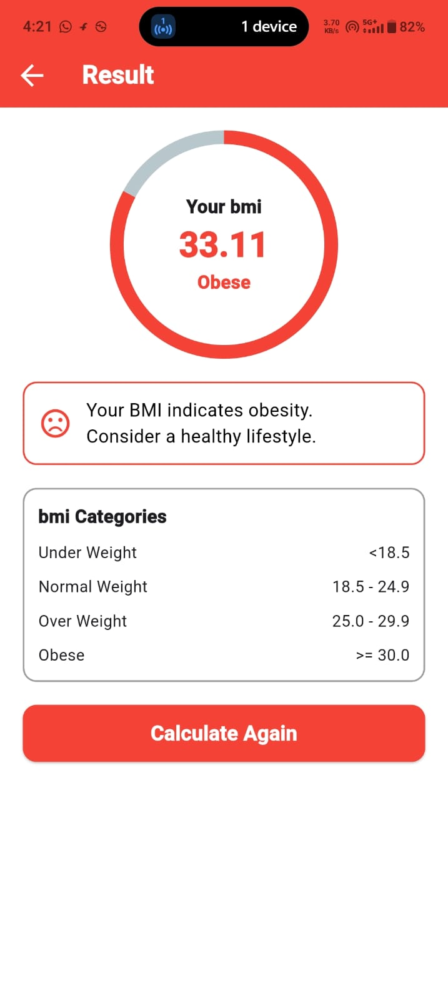
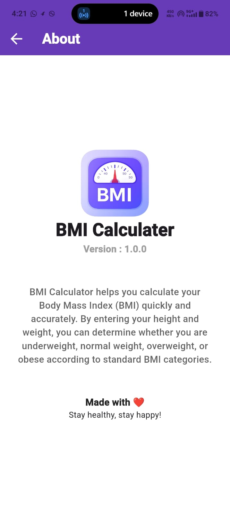

# BMI Calculator 📱

A simple and elegant **BMI (Body Mass Index) Calculator** built with **Flutter**. This app allows users to calculate their Body Mass Index based on height and weight, view their health category, and use a clean, responsive interface.

---

## 📸 Screenshots

> Add your app screenshot inside the `screenshots` folder.










---

## ✨ Features

- 🚀 Splash Screen
- 🏠 Home Screen
- ⚖️ BMI Calculation
- 📊 Result Screen
- 📈 Displays BMI Category
  - Underweight
  - Normal Weight
  - Overweight
  - Obese
- 🔄 Calculate Again Button
- ℹ️ About Screen
- 🎨 Clean & Modern UI
- 📱 Responsive Design

---

## 📱 Screens

- Splash Screen
- Home Screen
- Result Screen
- About Screen

---

## 🧮 BMI Formula

```text
BMI = Weight (kg) / Height² (m²)
```

---

## 📊 BMI Categories

| BMI Range | Category |
|-----------|----------|
| Less than 18.5 | Underweight |
| 18.5 – 24.9 | Normal Weight |
| 25.0 – 29.9 | Overweight |
| 30.0 and Above | Obese |

---

## 🛠️ Built With

- Flutter
- Dart
- Material Design

---

## 📂 Project Structure

```text
lib/
│
├── main.dart
│
└── screens/
    ├── splash_screen.dart
    ├── home_screen.dart
    ├── result_screen.dart
    └── about_screen.dart
```

---

## 🚀 Getting Started

### Clone the Repository

```bash
https://github.com/ankitprajapat42/bmi_calculater_app.git
```

### Navigate to the Project

```bash
cd bmi-calculator
```

### Install Dependencies

```bash
flutter pub get
```

### Run the App

```bash
flutter run
```

---

## 📦 Requirements

- Flutter SDK (Latest Stable Version)
- Dart SDK
- Android Studio / VS Code
- Android Emulator or Physical Device

---

## 🎯 Future Improvements

- 🌙 Dark Mode
- 📜 BMI History
- 💡 Health Tips
- 🔄 Unit Conversion (cm/ft & kg/lbs)
- 🎨 Theme Switching
- ✨ Better Animations

---

## 👨‍💻 Developer

**Ankit Prajapat**
B.Tech CSE Student  

GitHub: https://github.com/ankitprajapat42

---

## 🤝 Contributing

Contributions are welcome!

1. Fork this repository.
2. Create a new branch.
3. Commit your changes.
4. Push to your branch.
5. Create a Pull Request.

---

## ⭐ Support

If you like this project, don't forget to give it a **⭐ Star** on GitHub.

---

## 📄 License

This project is licensed under the **MIT License**.
